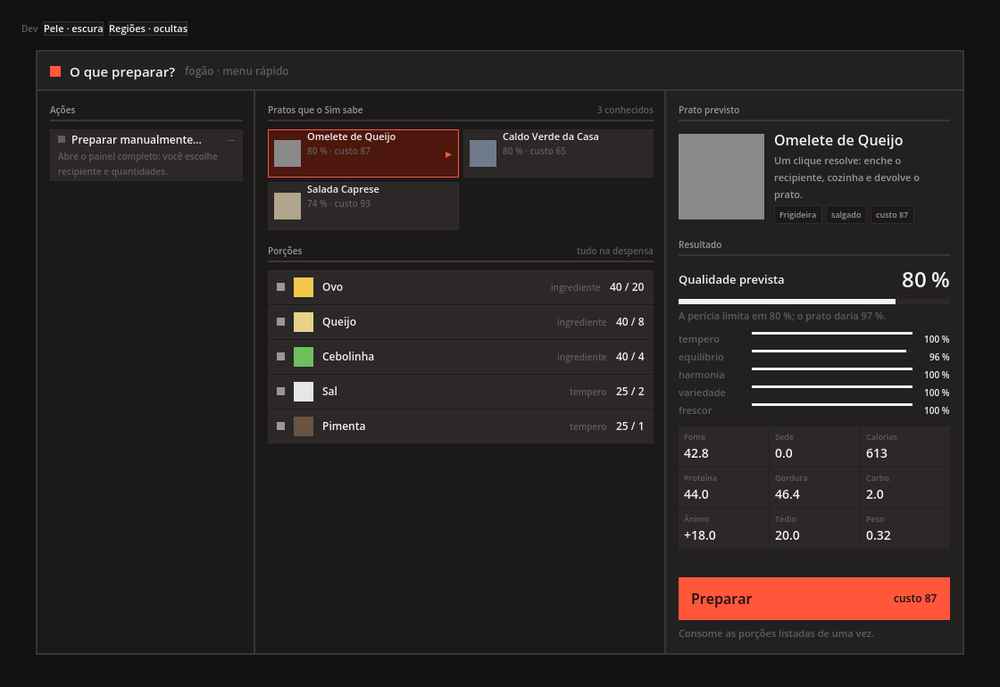
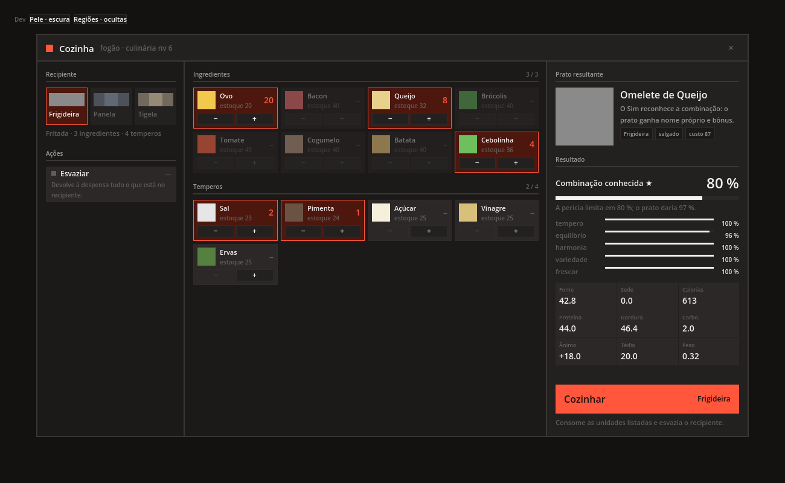
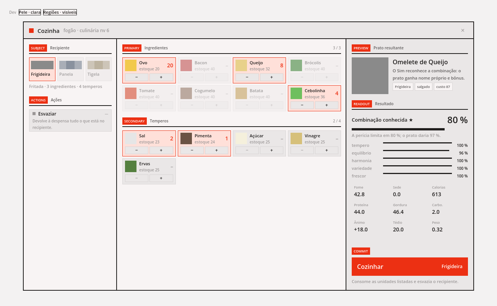

# Painel por contexto

Um painel para todas as interações do jogo. O shell (`UI/Context/ContextPanel.cs`) não conhece
cozinha, loja nem bancada: ele lê uma **definição de contexto**, liga cada primitivo à sua
região e desenha. Um sistema novo é uma definição nova e, no máximo, um primitivo novo —
nunca uma janela nova.

Tradução do mock HTML (`Context Panel`, feito no Claude Design) para Godot/C#. O mock continua
sendo a referência visual; este documento é o contrato.

## As telas

Capturas reais do projeto rodando em Godot 4.7 stable, não mockups.

O menu rápido — a porta de entrada padrão, com as porções da âncora escolhida como lista de
"tenho / preciso":



O painel manual, com a omelete completa montada e a âncora casada:



O mesmo painel com `ShowRegionLabels` ligado e a pele clara — é assim que se discute a
estrutura sem ler código:



## As sete regiões

Leem-se da esquerda para a direita: em que você age, o que você faz, o que resulta.

| Região | Obrigatória | Primitivos aceitos | Na cozinha |
|---|---|---|---|
| `Subject` | não | `Picker` | recipiente |
| `Actions` | não | `VerbList` | esvaziar |
| `Primary` | **sim** | `SlotGrid` · `Checklist` | ingredientes |
| `Secondary` | não | `SlotGrid` · `Checklist` | temperos |
| `Preview` | **sim** | `PreviewCard` | o prato que vai sair |
| `Readout` | **sim** | `Readout` | qualidade e os cinco fatores |
| `Commit` | **sim** | `CommitAction` | Cozinhar |

Região não preenchida não existe na tela — não há espaço reservado. O menu rápido não tem
`Subject` porque não há o que escolher antes do prato.

## Os primitivos

| Primitivo | O que é | Onde já é usado |
|---|---|---|
| `Picker` | ladrilhos de escolha única, com nota da opção ativa | recipiente |
| `VerbList` | verbos com perícia: alternâncias e comandos; travado aparece apagado | esvaziar · preparar manualmente |
| `SlotGrid` + `SlotGridMode.Quantity` | ladrilho com steppers ±, linha de estoque e orçamento de slots | ingredientes · temperos |
| `SlotGrid` + `SlotGridMode.Select` | o mesmo ladrilho como escolha única | pratos do menu rápido |
| `Checklist` | tenho versus preciso, linha a linha | porções do prato escolhido |
| `PreviewCard` | espaço de arte + nome + uma linha + etiquetas | prato resultante |
| `Readout` | valor grande com barra, fatores 0..1 e pilha de números | qualidade e nutrição |
| `CommitAction` | uma ação por contexto, com rótulo e bloqueio declarados | Cozinhar · Preparar |

Declarados no mock e ainda **não implementados**, por não existir sistema por trás deles neste
projeto: `grid.dual` (duas listas com eixo de movimento — transferência, saque, troca) e `text`
(prosa numa região). Entram quando entrar o inventário que os justifique.

## Regras

1. **A definição não fala de cor.** Ela diz `Selected`, `Warn`, `Locked`, `Enabled`, e a
   `PanelSkin` decide como isso se parece. Trocar a pele do jogo inteiro não toca em contexto
   nenhum.

2. **O shell não guarda estado.** A definição é reconstruída inteira a cada mudança, via
   `ContextPanel.Rebuild()`. Não existe caminho que atualize um pedaço da tela: é isso que
   garante que a tela nunca discorde do estado que a gerou. Quem guarda estado é o dono do
   contexto — na cozinha, a `CookingSession`.

3. **Número na tela vem do avaliador do sistema.** A região `Readout` só lê. Se aparecer conta
   dentro de `UI/`, ela está no lugar errado.

4. **A UI desabilita exatamente o que o modelo recusaria.** As condições de `PanelSlot.Enabled`
   na cozinha são as mesmas que `CookingSession.AddUnit` cobra. Exceção chegando ao jogador é
   bug de definição, não input.

## Escrever um contexto novo

Uma função pura de estado para `PanelContext`, em `UI/`. O modelo do sistema não a conhece.

```csharp
public static PanelContext Build(LojaSession session, Action onBuy, Action onClose) => new()
{
    Title = "Balcão",
    Crumb = $"{session.Vendor.DisplayName} · aberto até {session.ClosesAt}",
    Width = 1120f,
    OnClose = onClose,

    Subject = new PanelRegion { Title = "Vendedor", Body = new Picker { ... } },
    Primary = new PanelRegion { Title = "Na prateleira", Body = new SlotGrid
    {
        Mode = SlotGridMode.Quantity,
        Slots = session.Stock.Select(...).ToList(),
    } },
    Secondary = new PanelRegion { Title = "Recibo", Body = new Checklist { ... } },

    Preview = new PreviewCard { ... },
    Readout = new Readout { Title = "Resultado", Headline = "Dinheiro após a compra", ... },
    Commit = new CommitAction { Label = "Comprar", Enabled = !session.OverBudget, OnRun = onBuy },
};
```

O host — quem abre a interação — cria o `ContextPanel`, passa a definição como `Func<>` e
manda `Rebuild()` quando o estado muda:

```csharp
var panel = new ContextPanel { Definition = () => LojaContext.Build(session, Buy, Close), Skin = skin };
session.Changed += () => panel.Rebuild();
```

## Ferramentas de autoria

`ContextPanel.ShowRegionLabels` etiqueta cada região sobre o painel — útil para discutir a
estrutura sem ler código. `PanelSkin.Dark` / `PanelSkin.Light` trocam a pele inteira. A cena
de demonstração expõe as duas numa barra "Dev".

## O que ficou de fora da tradução

- **Fonte.** O mock usa Archivo; aqui só existe a fonte padrão do Godot, então o peso
  tipográfico é aproximado por tamanho.
- **Redesenho total.** Cada mudança reconstrói os nós do painel, como o mock reconstrói o DOM.
  É o que mantém a definição como fonte única. O custo é perder foco de teclado/controle a
  cada clique — se isso incomodar, o conserto é o shell reaproveitar nós, não a definição
  virar mutável.
- **Entrada real.** As capturas vêm de um display virtual: hover, foco e navegação por
  controle nunca foram exercitados.
